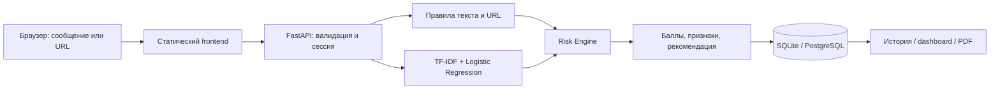

# Текущий браузерный интерфейс

После обновления локального помощника форма анализирует сообщения в `frontend/analyzer.js`, а история и обзор работают в памяти вкладки. Сетевые API ниже относятся к сохранённому серверному пути и не вызываются формой. Подсветка, диалог, RU/KK и границы данных описаны в [local-assistant.md](local-assistant.md).

# Сохранённая серверная архитектура

Frontend и API имеют общий origin. Статика не зависит от CDN; интерфейс работает с реальным API и не генерирует фиктивную статистику. Первое обращение устанавливает случайный session cookie. Сервер хранит SHA-256 этого токена как идентификатор владельца результатов. Все обращения к истории, очистке и PDF фильтруются по сессии.

Исходный текст находится в памяти запроса. Risk Engine возвращает признаки без совпавших секретных фрагментов. В БД идут только id, дата, канал, баллы, признаки, домены, рекомендации и версия модели. URL path/query и исходные сообщения не сохраняются. Домены тоже могут быть чувствительными; в банковском пилоте потребуются политика данных и шифрование/контроль доступа.

Модель загружается на старте; вычисления и синхронная БД выполняются в worker threads FastAPI. PostgreSQL использует пул 1–5 соединений на процесс. Общий лимитер сохраняет атомарные счётчики в SQL и использует UPSERT/RETURNING; конкурирующие приложения не обходят квоту. SQLite включает WAL для локальных чтений/записей. Ограничения: 10 000 символов на запись, тело 64 KiB, 20 URL, пакет 1–10 записей, до 200 результатов. Пакет сохраняется одной транзакцией; ошибка не оставляет частичную историю. История и PDF не возвращают просроченные результаты. Физическая очистка запускается при новой проверке; для строгого удаления по времени нужен планировщик.

Аккаунты: email → Resend → один HMAC-проверяемый OTP → cookie session → владелец истории. Код привязан к browser-session, истекает за 10 минут; пять неверных попыток закрывают challenge. При входе cookie ротируется и собственная анонимная история переносится в аккаунт. PostgreSQL advisory locks сериализуют подтверждения одной почты; SQLite использует write transaction. Почта уникальна и нормализуется в нижний регистр. Телефон не запрашивается; миграция удаляет старые номера из активных таблиц, сохраняя ID, почту, сеансы и историю. Старые двухкодовые challenges отменяются. Account delete удаляет адрес, историю, отзывы и сеансы. Регистрация на Render с временным SQLite заблокирована.
