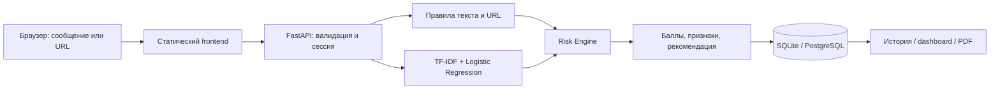

# Архитектура

Frontend и API имеют общий origin. Статика не зависит от CDN; интерфейс работает с реальным API и не генерирует фиктивную статистику. Первое обращение устанавливает случайный session cookie. Сервер хранит SHA-256 этого токена как идентификатор владельца результатов. Все обращения к истории, очистке и PDF фильтруются по сессии.

Исходный текст находится в памяти запроса. Risk Engine возвращает признаки без совпавших секретных фрагментов. В БД идут только id, дата, канал, баллы, признаки, домены, рекомендации и версия модели. URL path/query и исходные сообщения не сохраняются. Домены тоже могут быть чувствительными; в банковском пилоте потребуются политика данных и шифрование/контроль доступа.

Модель загружается на старте; вычисления и синхронная БД выполняются в worker threads FastAPI. PostgreSQL использует пул 1–5 соединений на процесс. Общий лимитер сохраняет атомарные счётчики в SQL и использует UPSERT/RETURNING; конкурирующие приложения не обходят квоту. SQLite включает WAL для локальных чтений/записей. Ограничения: 10 000 символов на запись, тело 64 KiB, 20 URL, пакет 1–10 записей, до 200 результатов. Пакет сохраняется одной транзакцией; ошибка не оставляет частичную историю. История и PDF не возвращают просроченные результаты. Физическая очистка запускается при новой проверке; для строгого удаления по времени нужен планировщик.

Аккаунты: phone + email → Twilio/Resend → два HMAC-проверяемых OTP → cookie session → владелец истории. Коды привязаны к browser-session, истекают за 10 минут, пять неверных попыток закрывают challenge. При входе cookie ротируется и собственная анонимная история переносится в аккаунт. PostgreSQL advisory locks сериализуют подтверждения совпадающих контактов; SQLite использует write transaction. Пара контактов уникальна и не меняется через регистрацию. Account delete удаляет контакты, историю, отзывы и сеансы. Регистрация на Render с временным SQLite заблокирована.

Для нескольких реплик требуются одна PostgreSQL, одинаковый AUTH_SECRET, корректный trust proxy, согласованное число соединений и нагрузочный тест. Общие квоты и пул уже реализованы; SSO/роли, tenant isolation, registry модели, очереди PDF, observability и timed cleanup остаются до пилота. При reverse proxy peer может быть общим; не доверять произвольному X-Forwarded-For. Публичная инфраструктура остаётся одной бесплатной репликой: ресурсы/тарифы автоматически не увеличены.

В аккаунтах сохраняются контакты с явным согласием, в pending challenges — контакты и HMAC до expiry/очистки, в сеансах — hash cookie. В feedback — производные признаки и домены по отдельному согласию, без сообщения. Это дополнение к модели данных результатов; прежнее утверждение «в БД только признаки» относится к checks, а не к аккаунтам. Локализация и договоры провайдеров — в `auth-setup.md` и странице `/#privacy`.
