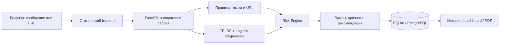

# Текущий браузерный интерфейс

После обновления локального помощника форма анализирует сообщения в `frontend/analyzer.js`, а история и обзор работают в памяти вкладки. Сетевые API ниже относятся к сохранённому серверному пути и не вызываются формой. Подсветка, диалог, RU/KK и границы данных описаны в [local-assistant.md](local-assistant.md).

# Сохранённая серверная архитектура

Frontend и API имеют общий origin. Статика не зависит от CDN; интерфейс работает с реальным API и не генерирует фиктивную статистику. Первое обращение устанавливает случайный session cookie. Сервер хранит SHA-256 этого токена как идентификатор владельца результатов. Все обращения к истории, очистке и PDF фильтруются по сессии.

Исходный текст находится в памяти запроса. Risk Engine возвращает признаки без совпавших секретных фрагментов. В БД идут только id, дата, канал, баллы, признаки, домены, рекомендации и версия модели. URL path/query и исходные сообщения не сохраняются. Домены тоже могут быть чувствительными; в банковском пилоте потребуются политика данных и шифрование/контроль доступа.

Один процесс/реплика: rate limit в памяти, модель на старте, синхронные вычисления и БД в worker threads FastAPI. Ограничения: 10 000 символов, тело 64 KiB, 20 URL, до 200 результатов сессии. Данные старше 7 дней удаляются при новой проверке. Это opportunistic cleanup, а не гарантированный timed deletion; для пилота добавить отдельную задачу очистки.

Для масштабирования: общий limiter, SSO и роли, tenant isolation, централизованный реестр/версионирование модели, пул соединений, очереди фоновых отчётов, наблюдаемость и регулярная очистка. Не масштабировать число реплик до замены process-local limiter. При reverse proxy текущий limiter видит адрес proxy: консервативно ограничивает общий поток. Настраивать доверенные proxy и клиентский IP только после подтверждения конфигурации сети.
